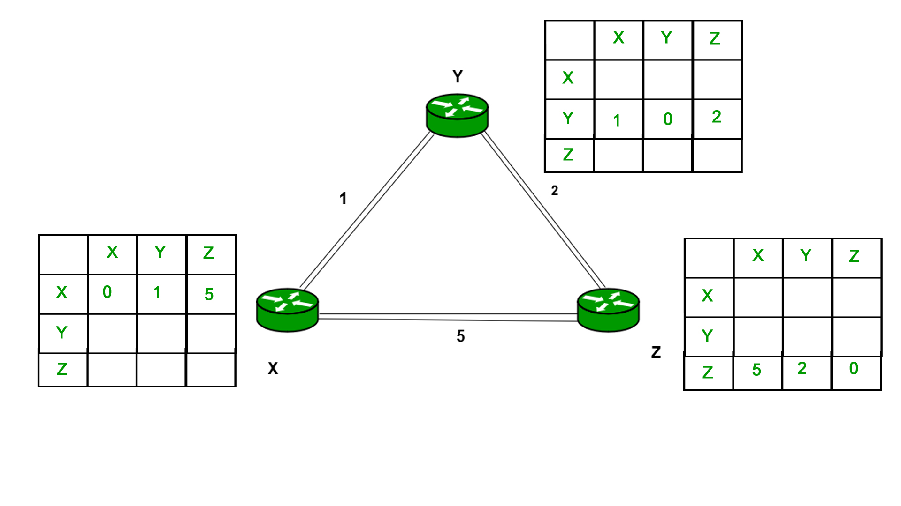
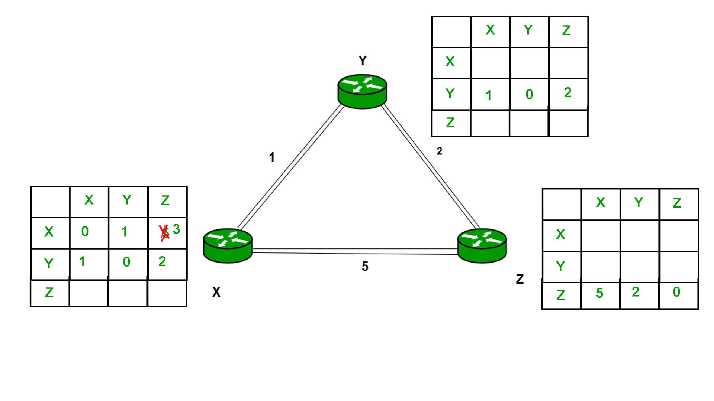
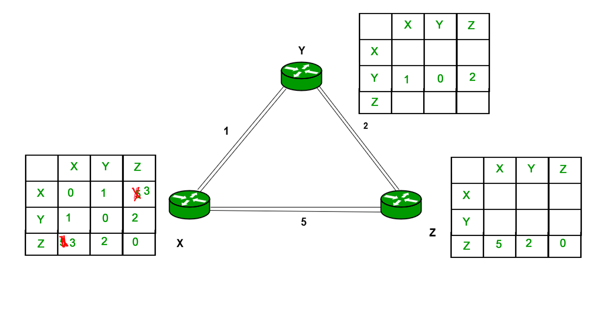
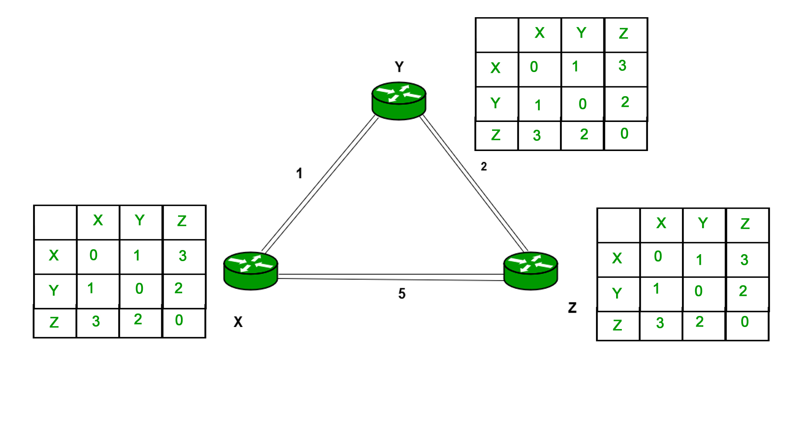

# Distance Vector Routing Algorithm
This repository is C implementation of Distance Vector Routing algorithm.

## Files

```
.
├── src
├── img
├── CMakeList.txt
├── .clang-format
└── README.md
```
## Dependencies

* [CMake](https://www.mlpack.org/)   Version 3.17.5

## Dependencies Installation

* [CMake](https://www.mlpack.org/)   Version 3.17.5

Install [CMake](https://www.mlpack.org/) from source. 

```bash
sudo apt-get install -y -q wget
wget https://cmake.org/files/v3.17/cmake-3.17.5.tar.gz 
tar xzf cmake-3.17.5.tar.gz 
cd cmake-3.17.5 
./bootstrap -- -DCMAKE_BUILD_TYPE:STRING=Release 
make -j4 # where j is the number of core
sudo make install
```

## Demo

To build run the following command in terminal:

```bash
mkdir build
cd build
cmake ..
make -j4 
```

```bash
$ ./distance-vector-rounting-algorithm
```

## Iterations


<p align="left">
    
  <br/>
  Fig. Iteration 1
</p>


<p align="left">
  
  <br/>
  Fig.  Iteration 2
</p>


<p align="left">
     
  <br/>
  Fig. Iteration 3
</p>


<p align="left">
  
   
  <br/>
  Fig.  Iteration 4
</p>


## References

[Distance Vector Routing]()

[Distance Vector Routing]()


## To-Do List

- :negative_squared_cross_mark: Update README.md
- :negative_squared_cross_mark: Add CMake Cross Platform Support


