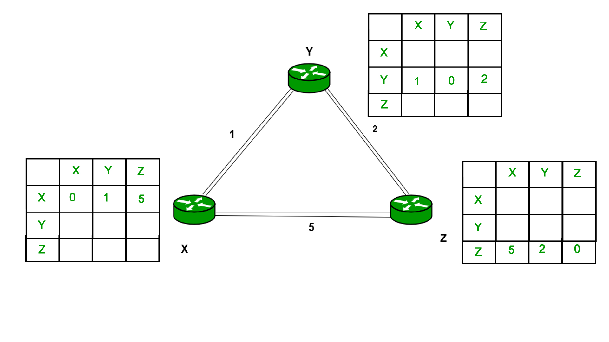
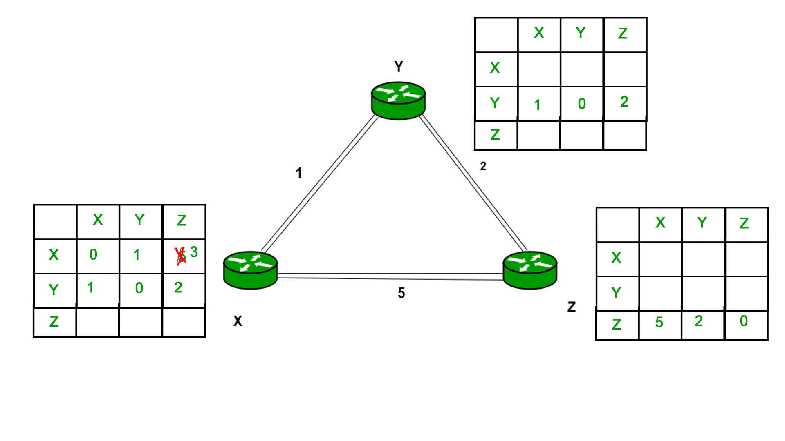
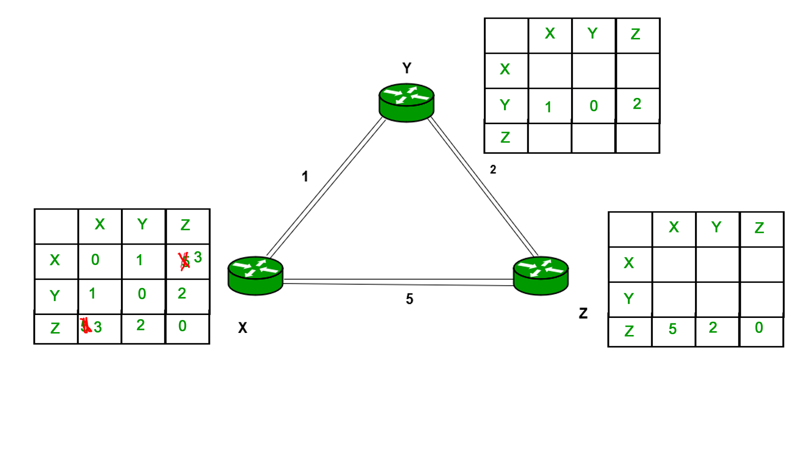
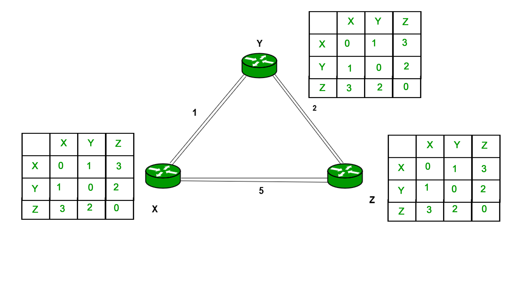

# distance-vector-routing-algorithm
distance vector routing algorithm Implementation in C 

    
   
  Fig. Iteration 1

  
   
  Fig.  Iteration 2

     
   
  Fig. Iteration 3

  
   
   
  Fig.  Iteration 4

